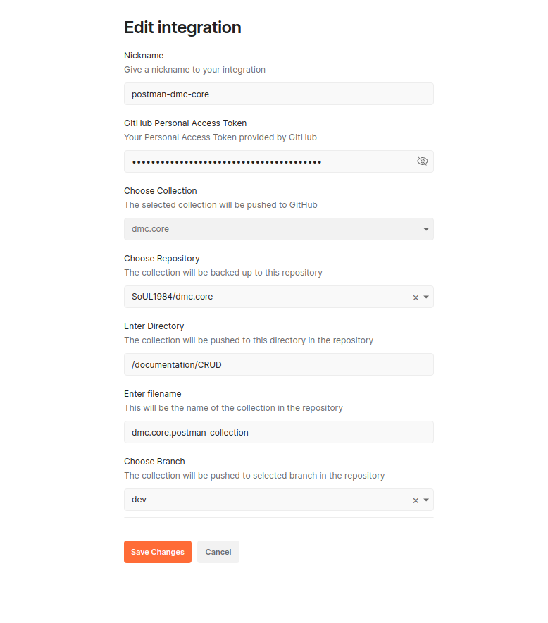

## Начало работы с docker-compose

Для работы в Visual Studio Code можно установить плагин для работы с Docker

Очистка docker-compose
https://www.digitalocean.com/community/tutorials/how-to-remove-docker-images-containers-and-volumes-ru

* docker system prune
* docker system prune -a
* docker images -a
* docker rmi Image Image

Чтобы пересобрать docker-compos нужно выполнить последовательно две команды

* docker-compose build
* docker-compose up

Необходимо изучить механизм работы с докером на этой странице TODO: https://github.com/IvoNet/docker-mysql  

Чтобы присоединиться и наблюдать за docker-compose нужно выполнить команду   
docker ps     // выводит список всех запущенных контейнеров  
docker ps -a  // выводит список всех контейнеров  

docker run -it ubuntu:18.10 /bin/bash // запустить и подключиться к контейнеру  
docker container logs -f dff69b8decc8 // наблюдаем за работой контейнера  
docker exec -it 7579c85c8b7e /bin/bash  // подключиться к существующему контейнеру  

Также к контейнеру можно присоединяться и в нем работать как в операционной системе  

В docker-compose есть хранилище данных, поэтому инициализация базы данных происходит один раз.  
Если нужно остановить docker-compose и удалить все хранилища, чтобы снова проиницилизировать и пересоздать базу данных, нужно воспользоваться командой.
docker-compose down -v  

connect db (https://stackoverflow.com/questions/50379839/  connection-java-mysql-public-key-retrieval-is-not-allowed):  

Если есть проблемы при подключении к базе данных через DBeaver:  

Right click your connection, choose "Edit Connection"  
On the "Connection settings" screen (main screen) click on "Edit Driver Settings"  
Click on "Connection properties"  
Right click the "user properties" area and choose "Add new property"  
Add two properties: "useSSL" and "allowPublicKeyRetrieval"  
Set their values to "false" and "true" by double clicking on the "value" column  

## Настройка интеграции postman и github

Для интеграции postman и github, необходимо завести token в github (Заходим в пользователя Settings -> Developer settings -> Personal access tokens -> Заводим токен с галочкой repo(одна галочка)).  

Затем идем в postman Home -> Integrations -> Browse All Integrations -> GitHub -> Backup a collection  

**Пример Postman итеграции через backup**

